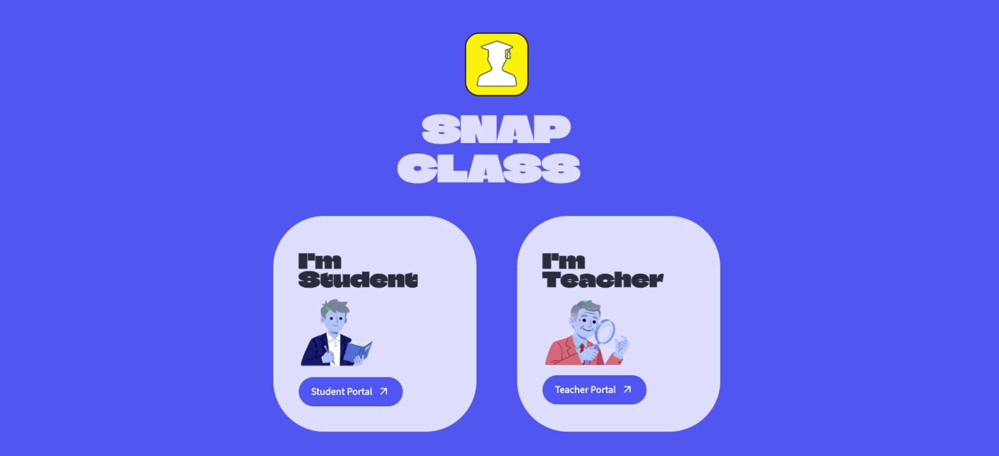
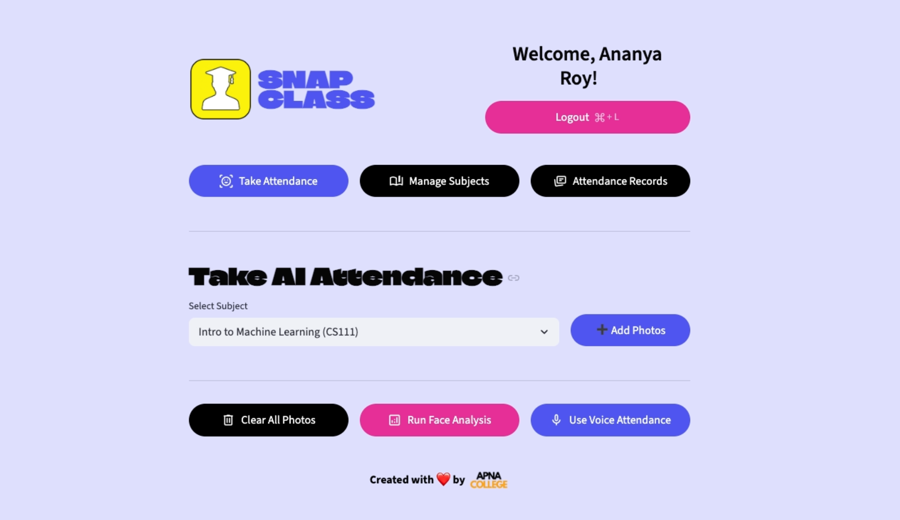
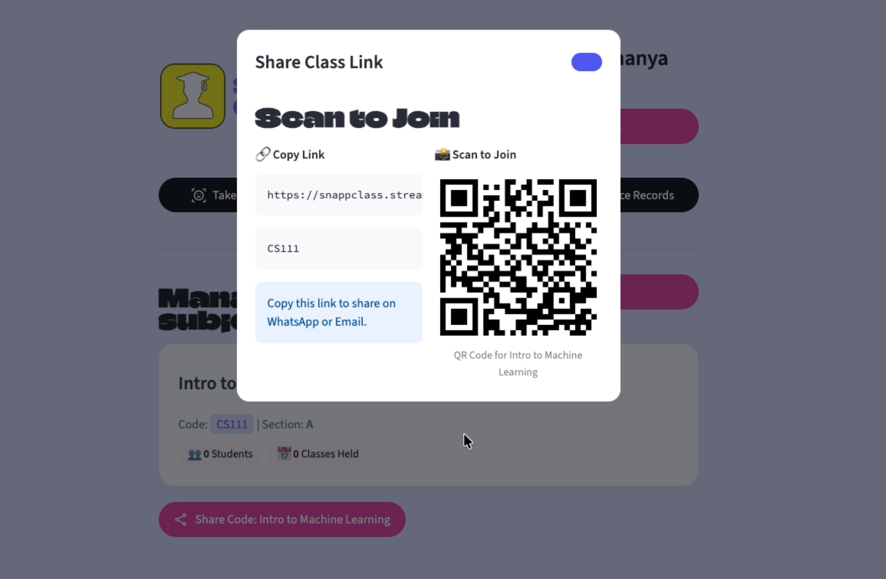
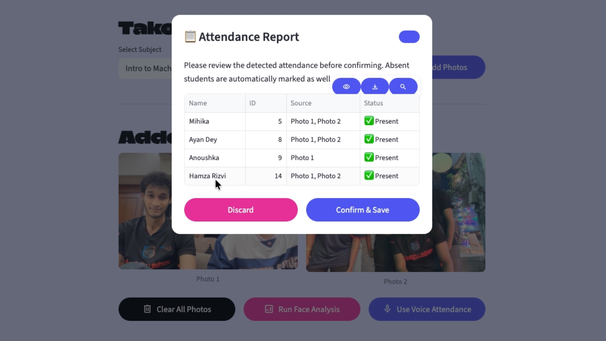
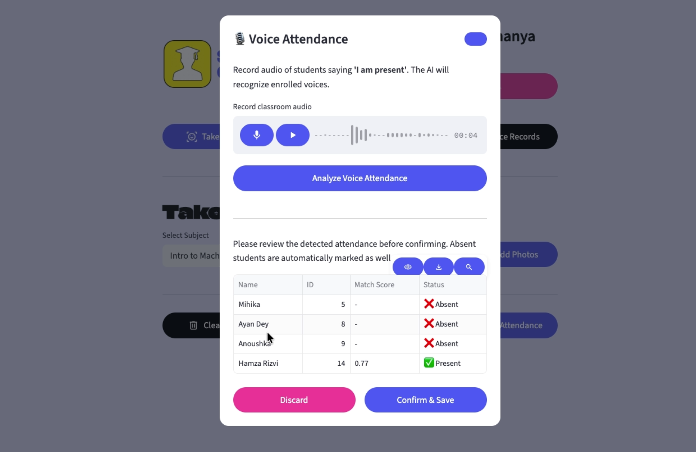
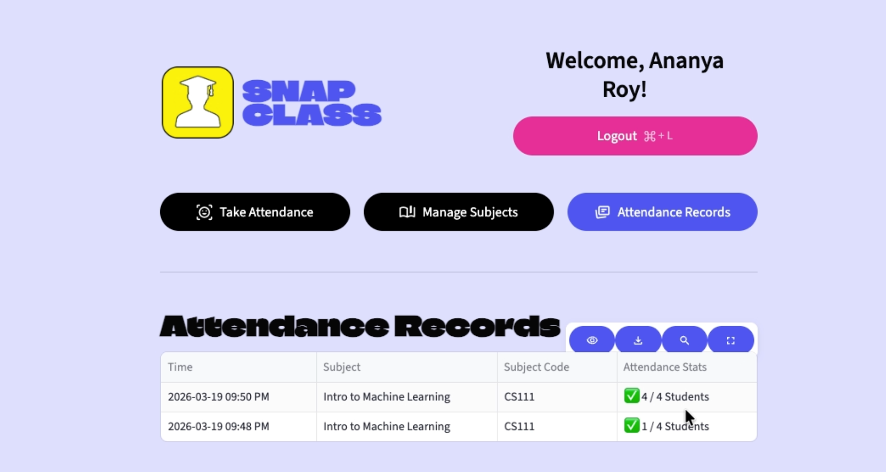
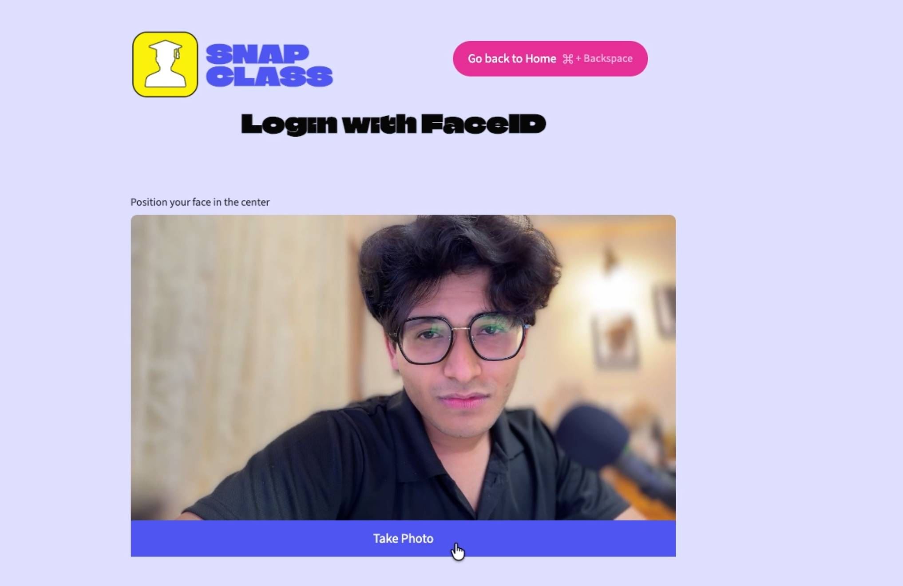
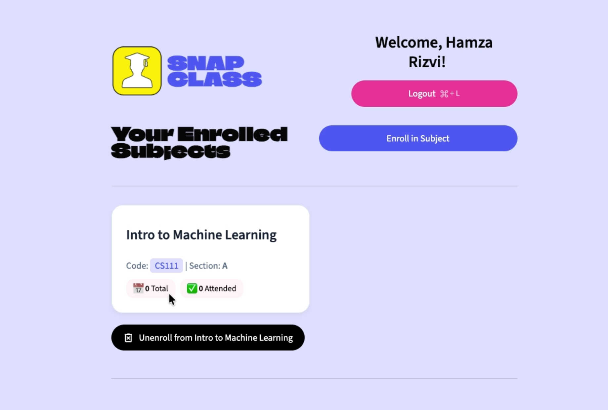

# SnapClass — AI Attendance with Face & Voice Recognition

Project Live Link : https://intelligent-ai-attendance--face---voice-recognition-ibbpypntqn.streamlit.app/
Project Live Landing Page: https://snapclass-landing-page-seven-nu.vercel.app/

Classroom attendance taken from a photo of the room or a recording of students
speaking, instead of a roll call. Teachers create a subject, share a join code
or QR, and students enrol themselves and sign in with their face.



---

## How it works

**Face attendance.** dlib detects every face in the uploaded classroom photos
and turns each one into a 128-dimension descriptor. Those are matched against
the enrolled students' stored descriptors — an SVM picks the closest candidate
and a Euclidean distance check (threshold `0.5`) confirms or rejects it. Every
enrolled student is then marked present or absent, and the teacher reviews the
list before anything is saved.

**Voice attendance.** Resemblyzer turns a recording of the class into speaker
embeddings and compares them by cosine similarity (threshold `0.72`) against
each enrolled student's saved voice sample.

Both thresholds live in `src/pipelines/` and are worth tuning for your room —
stricter values mean fewer false positives but more students wrongly marked
absent.

## Stack

| Layer | Tech |
|---|---|
| UI | Streamlit |
| Face | dlib (`dlib-bin`) + `face_recognition_models`, scikit-learn SVC |
| Voice | Resemblyzer, librosa, soundfile |
| Database | Supabase (PostgreSQL) |
| Auth | bcrypt for teachers, face match for students |
| QR codes | segno |

## Project layout

```
app.py                     entry point and routing
src/
  screens/                 home, teacher, student screens
  components/              dialogs and cards
  pipelines/
    face_pipeline.py       dlib embeddings, SVM, distance check
    voice_pipeline.py      Resemblyzer embeddings, similarity
  database/
    config.py              Supabase client from st.secrets
    db.py                  all queries
  ui/base_layout.py        theme and CSS
```

---

## Walkthrough

### Teacher

Log in, then create a subject and share its code.



Every subject gets a join link and QR code students can scan.



Add classroom photos, run the analysis, and review before saving.



Or record the class and let voice recognition do it.



Past sessions are listed with a per-student breakdown.



### Student

Students sign in with their face — no password. A first-time face prompts
registration, with an optional voice sample.



Then they browse courses or enter a code to enrol, and track their own
attendance per subject.



---

## Setup

### 1. Database

In the Supabase SQL editor:

```sql
create table teachers (
  teacher_id bigint generated always as identity primary key,
  username   text unique not null,
  password   text not null,            -- bcrypt hash
  name       text not null
);

create table students (
  student_id      bigint generated always as identity primary key,
  name            text not null,
  face_embedding  jsonb,               -- 128-d dlib descriptor
  voice_embedding jsonb                -- Resemblyzer embedding
);

create table subjects (
  subject_id   bigint generated always as identity primary key,
  subject_code text unique not null,   -- the unique constraint matters, see below
  name         text not null,
  section      text,
  teacher_id   bigint references teachers(teacher_id) on delete cascade
);

create table subject_students (
  subject_id bigint references subjects(subject_id) on delete cascade,
  student_id bigint references students(student_id) on delete cascade,
  primary key (subject_id, student_id)
);

create table attendance_logs (
  id         bigint generated always as identity primary key,
  student_id bigint references students(student_id) on delete cascade,
  subject_id bigint references subjects(subject_id) on delete cascade,
  timestamp  timestamptz not null,
  is_present boolean not null default false
);
```

**If your `subjects` table already exists**, make sure `subject_code` is
unique. Duplicate codes break the teacher dashboard and can enrol a student
into the wrong subject, because the join-by-code lookup takes the first match:

```sql
-- find duplicates
select subject_code, count(*) from subjects
group by subject_code having count(*) > 1;

-- after renaming or deleting them
alter table subjects add constraint subjects_code_unique unique (subject_code);
```

### 2. Row Level Security

The app talks to Supabase directly with the anon key, which is visible to
anyone who opens the site. Enable RLS on all five tables:

```sql
alter table teachers         enable row level security;
alter table students         enable row level security;
alter table subjects         enable row level security;
alter table subject_students enable row level security;
alter table attendance_logs  enable row level security;
```

RLS with no policies blocks every query, including the app's, so add a policy
per table. The permissive baseline that matches the app's current access model:

```sql
create policy "allow anon all" on teachers          for all using (true) with check (true);
create policy "allow anon all" on students          for all using (true) with check (true);
create policy "allow anon all" on subjects          for all using (true) with check (true);
create policy "allow anon all" on subject_students  for all using (true) with check (true);
create policy "allow anon all" on attendance_logs   for all using (true) with check (true);
```

This satisfies RLS but does not actually restrict anything — see
[Limitations](#limitations).

### 3. Run it

```bash
python3.11 -m venv venv
source venv/bin/activate          # Windows: venv\Scripts\activate
pip install -r requirements.txt

cp .streamlit/secrets.toml.example .streamlit/secrets.toml
# fill in SUPABASE_URL and SUPABASE_KEY

streamlit run app.py
```

On Debian/Ubuntu also install the system package in `packages.txt`:
`sudo apt install libsndfile1`.

The first install is slow — dlib and torch are large. `requirements.txt` pins
the CPU-only torch wheel; without it, Resemblyzer's dependency resolves to the
CUDA build and pulls several GB of `nvidia-*` packages.

---

## Deploying to Streamlit Community Cloud

1. Push to GitHub. `.streamlit/secrets.toml` is gitignored — don't commit it.
2. On [share.streamlit.io](https://share.streamlit.io), create an app pointing
   at `app.py`, branch `main`, Python 3.11.
3. Under **Advanced settings → Secrets**, paste:
   ```toml
   SUPABASE_URL = "https://your-project-ref.supabase.co"
   SUPABASE_KEY = "your-anon-public-key"
   ```
4. Deploy and watch the build log.

Camera and microphone capture need HTTPS, which Streamlit Cloud provides.

**Free-tier Supabase projects pause after about a week of inactivity**, and
every query fails while paused. If you're demoing, open the app beforehand.

---

## Limitations

Known gaps, listed honestly rather than hidden:

- **No liveness detection.** Student login is face-only, so a photo held up to
  the camera will pass. Fine for a demo, not for anything graded on security.
- **One face embedding per student.** The SVM has a single sample per class, so
  the distance check is doing most of the real work. Accuracy drops when
  lighting differs a lot from the registration photo.
- **RLS policies are permissive.** Anyone with the anon key still has full
  read/write, including the `teachers` table with its bcrypt hashes. Real
  per-user policies need Supabase Auth issuing JWTs, which this app doesn't use.
- **Timestamps are written in naive local time** into a `timestamptz` column.
  Display is self-consistent, but external SQL against the column will be off
  by your UTC offset.
- **Voice matching is threshold-based**, with no noise handling. A loud room
  will need `0.72` tuned.

## Credits

Original SnapClass project and design by Sambodh Gupta (Apna College).
